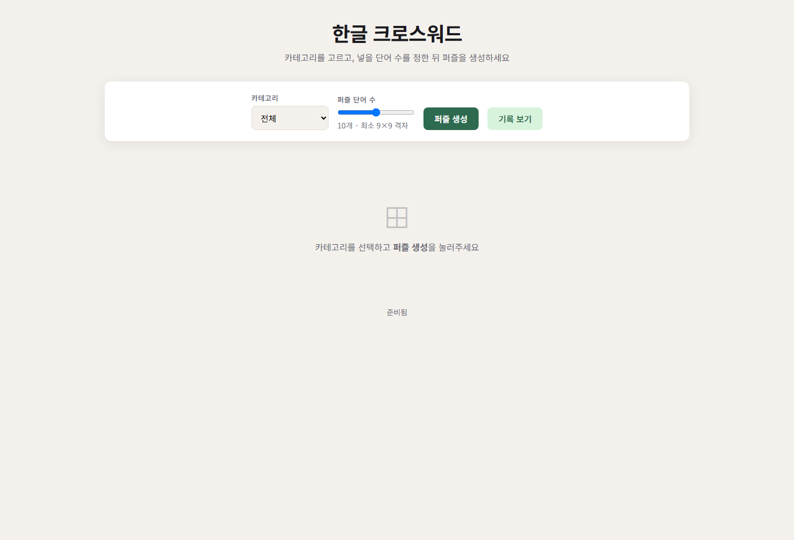

# 한글 크로스워드 퍼즐

카테고리별 단어로 가로·세로 크로스워드를 자동 생성하는 웹 앱입니다.

## 실행 방법

`index.html`을 바로 열어도 동작합니다.  
권장: 간단한 로컬 서버로 실행

```bash
python -m http.server 8080
# http://localhost:8080
```

## 현재 기능

- 카테고리 5종 + 통합 카테고리 `전체`
- 카테고리별 단어 620개(총 3100단어)
- 퍼즐 생성 후 시작 오버레이 + `게임 시작` 버튼
- 시작 시 타이머 동작, 모든 칸 입력 시 자동 종료/채점
- 결과 요약(풀이 시간, 정답률, 정답 수) + 오답 강조 표시
- `게임 다시하기` 지원
- 풀이 기록 저장/조회(LocalStorage, 최근 50개)

## 스크린샷

### 메인 화면



## 데이터 관리

- 원본 데이터: `scripts/generate-categories.cjs`
- 시드 단어: `scripts/seed-data/*.js`
- 확장 워드팩: `scripts/word-packs/*.js` (사전 기반 단서 생성)
- 수동 보정: `scripts/factual-clues.js`
- 생성 결과: `data/categories.js` (인코딩된 페이로드, `js/category-loader.js`에서 복호화)

데이터 재생성:

```bash
# 1) 신규 단어 워드팩 생성 (표준국어대사전·우리말샘 조회, 시간 소요)
node scripts/build-word-packs.cjs

# 2) categories.js 빌드
node scripts/generate-categories.cjs
```

시드 단어 정리:

```bash
node scripts/sanitize-seed-data.cjs
```

### 단어·단서(문제) 추가 규칙

카테고리에 단어를 추가하거나 단서를 수정할 때는 추측으로 쓰지 말고, 사전과 인터넷 정보로 뜻을 확인한 뒤 **정확하고 완결된 한국어 문장**으로 단서를 작성합니다.

**필수 확인 절차**

1. [표준국어대사전](https://stdict.korean.go.kr)과 [우리말샘](https://opendict.korean.go.kr)에서 해당 단어의 뜻을 확인합니다.
2. 동음이의어·다의어는 카테고리 맥락(동물/음식/과일/직업/자연)에 맞는 뜻만 고릅니다.
3. 사전 정의가 모호하거나 최신 용어면 신뢰할 수 있는 인터넷 자료로 보완 검증합니다.
4. `sync-clues-from-dict.cjs` 자동 생성 결과도 위 기준으로 검토하고, 부정확하면 `factual-clues.js` 또는 `generate-categories.cjs`에 수동으로 고칩니다.

**단서 문장 품질**

- 10~25자(공백 포함), 완전한 설명문·정의문 형태
- 정답 단어가 단서에 포함되면 안 됨
- 두리뭉실한 표현 금지 (예: `크리에이터` → "온라인 콘텐츠를 만드는 사람")
- 카테고리와 무관한 뜻 금지 (예: `바람` → "남의 비난의 목표…" 대신 "대류현상으로 공기가 수평 이동하는 것")
- 깨진 글자, 잘린 문장, 사전식 괄호 설명 그대로 복사 금지

**좋은 예**

| 단어 | 단서 |
|------|------|
| 샘물 | 샘에서 솟아나는 물을 뜻하는 순우리말 |
| 빙하 | 눈이 오래 쌓여 굳어 만들어진 얼음 덩어리 |
| 바람 | 대류현상으로 공기가 수평 이동하는 것 |

**작업 후**

```bash
node scripts/generate-categories.cjs
node scripts/validate-stdict.cjs   # 필요 시 사전 검증
```

## 주요 파일

- `index.html` : 메인 UI 구조
- `styles.css` : 전체 스타일
- `js/app.js` : 게임 진행, 입력/채점, 타이머, 기록 UI
- `js/crossword.js` : 퍼즐 배치/번호 매기기/단어 선택 로직
- `data/categories.js` : 최종 카테고리 단어/단서 데이터(인코딩)
- `js/category-loader.js` : 카테고리 데이터 복호화
- `scripts/generate-categories.cjs` : 데이터 소스/검증/생성 스크립트
- `scripts/factual-clues.js` : 수동 보정 단서
